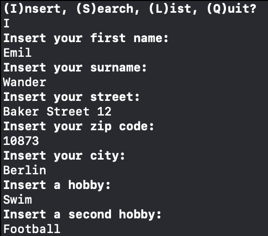
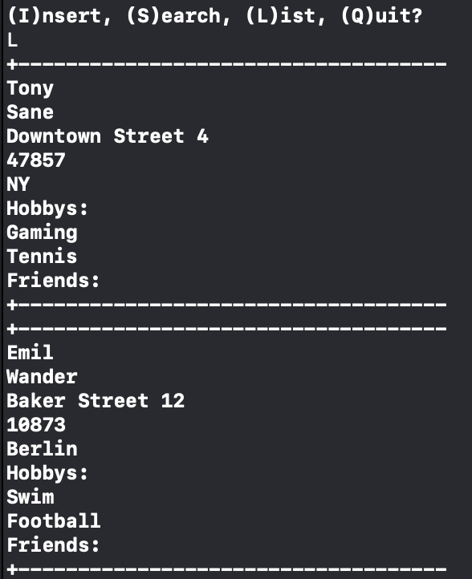

# Address-Book-Command-Line
This is an interactive address book using the command line.
This was a teamwork-project @[bbrinx](https://github.com/bbrinx).

## Preview
<b>Insert a new conatct</b> 
 

<b>List all inserted contacts</b> 
 

<b>Add a new friend to existing contacts</b> 

